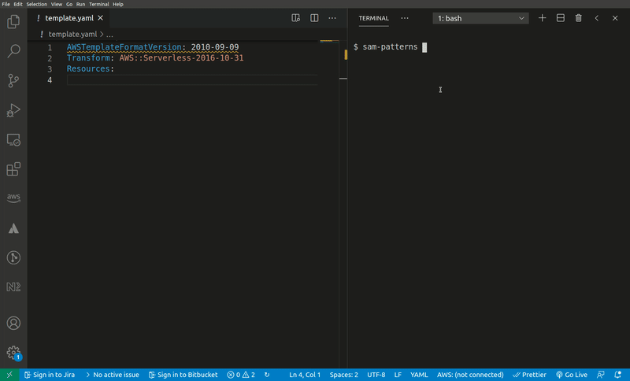
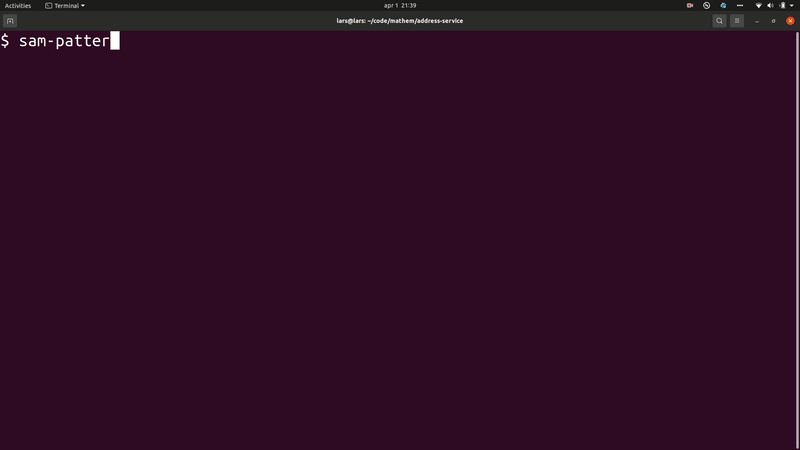

# sam-patterns-cli

*Note: this is an early version of a CLI backed by an early version of a community driven resource; https://serverlessland.com/patterns/. There might be bugs*

This tool lets you browse the content of the [Serverless Patterns Collection](https://serverlessland.com/patterns/) and inject patterns directly into your SAM template. Support for both JSON and YAML.

## Installation
`npm install -g sam-patterns-cli`

Acquire a Github access token from [here](https://github.com/settings/tokens) and store it in environment variable `GITHUB_TOKEN`. This is not strictly required, but if you don't you'll be rate limited to 60 requests per hour.

## Usage

### sam-patterns import
Imports a serverless pattern into an existing template

```
Usage: sam-patterns [options] [command]

Options:
  -v, --vers          output the current version
  -h, --help          display help for command

Commands:
  import|i [options]  Imports a pattern from https://github.com/aws-samples/serverless-patterns/
  help [command]      display help for command
```


### sam-patterns explore
Lets you browse and explore your serverless patterns repositories. You can either visualise them using [cfn-diagram](https://github.com/mhlabs/cfn-diagram) or click through to the pattern's documentation. 

```
Usage: sam-patterns explore|e [options]

Explores and visualises patterns from https://github.com/aws-samples/serverless-patterns/

Options:
  -h, --help  display help for command
```


### sam-patterns source
Lets you add more sources. This could be public repositores, such as Jermey Daly's [Serverless Reference Architectures](https://www.jeremydaly.com/serverless-reference-architectures/) or a private repository for company specific patterns.

Example how to add Jeremy Daly's reference architectures as a source:
```
? GitHub owner: serverless-architecture
? GitHub repo: reference-architectures
? Root: folder /
? Relative path to template file: /sam
? Template filename(s): template.yaml,template.yml
? URL (use #PATTERN_NAME# as placeholder): https://jeremydaly.com/the-#PATTERN_NAME#-pattern
```

If you create your own collection you need to follow this structure:
```
  The repository should follow the following structure. (README.md is optional):
  ├── pattern-1
  | ├── README.md
  │ └── template.yaml
  ├── pattern-2
  | ├── README.md
  │ └── template.yaml
  └── pattern-3
  | ├── README.md
    └── template.yaml
```

## Known issues and limitations
* Comments in YAML disappear when parsing the template
* Only content form the template.yaml file will be imported. Any supporting files like lambda functions or openapi schemas will not be imported.
* Only works with SAM templates
